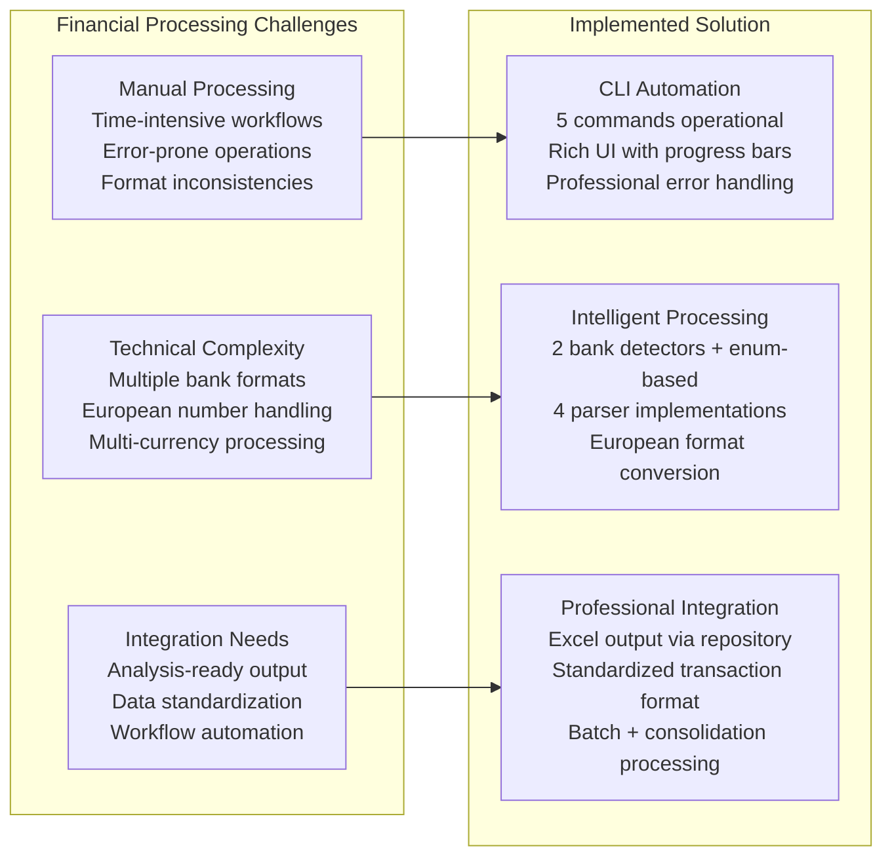
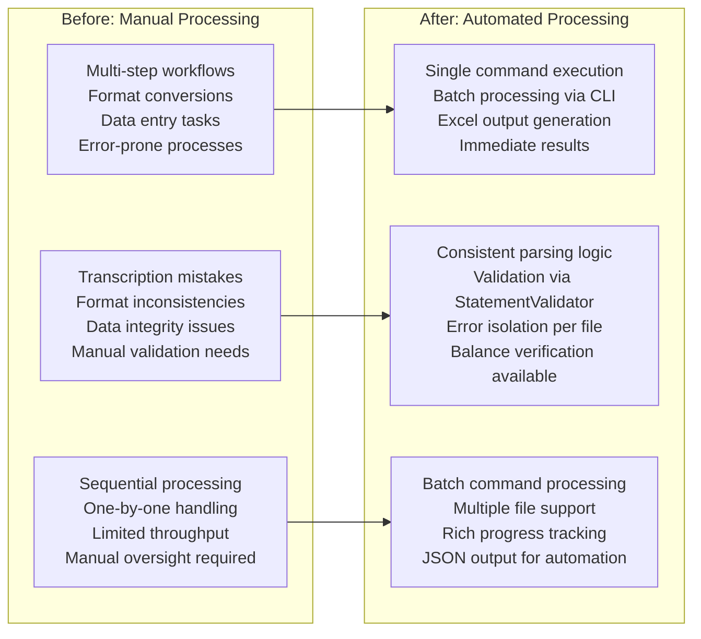

# Product Context - Financial Statement Processor

## Problem-Solution Architecture (Code-Verified)

## Argentine Banking Complexity Solutions (Implementation Verified)

**European Number Format Implementation**:

- **Problem**: Argentine banks use 1.234,56 format vs standard 1,234.56
- **Solution**: AmountParser class in domain/utils.py with `parse_european_format()` method
- **Implementation**: Pattern recognition with Decimal conversion for financial precision

**Multi-Currency Processing Implementation**:

- **Problem**: ARS and USD mixed within single statements
- **Solution**: Currency enum (ARS, USD) in domain/models.py with separate transaction tracking
- **Implementation**: Transaction-level currency assignment via TransactionBuilder

**Bank-Specific Layout Implementation**:

- **Problem**: Each institution has unique statement templates and formats
- **Solution**: PaymentMethod enum with 6 specific Argentine bank types in domain/models.py
- **Implementation**: Strategy pattern with MacroDetector + BBVADetector in infrastructure/detectors.py

**Date Format Variation Implementation**:

- **Problem**: Multiple date patterns (DD.MM.YY, DD-MMM-YY, ISO timestamps)
- **Solution**: DateConverter class in domain/utils.py with multiple format support
- **Implementation**: `convert_dd_mm_yy()` and `convert_dd_mmm_yy()` methods in TransactionBuilder

## Business Capabilities Implementation (Code-Verified)

**Payment Method Support**:

- **MACRO_VISA** - PDF statements via MacroDetector + PDFStatementParser (infrastructure/parsers/pdf_parser.py)
- **BBVA_VISA** - PDF statements via BBVADetector + PDFStatementParser
- **BBVA_MASTERCARD** - PDF statements with DD-MMM-YY format via BBVADetector + PDFStatementParser
- **BBVA_ACCOUNT** - XLS statements via BBVADetector + XLSStatementParser
- **MACRO_ACCOUNT** - XLS statements via MacroDetector + XLSStatementParser
- **MERCADOPAGO** - XLSX statements via enum-based detection + XLSXStatementParser

**Transaction Type Intelligence (PDF Parser Implementation)**:

- **Regular Purchases** - Reference number extraction via regex patterns (200+ lines in pdf_parser.py)
- **Payment Transactions** - "SU PAGO EN PESOS/USD" processing with negative classification
- **Tax Entries** - "IMPUESTO", "IIBB", "IVA RG" keyword detection with pattern matching
- **Adjustments & Credits** - "AJUSTE", "BONIF" processing with credit classification
- **Multi-Currency Detection** - USD pattern matching within ARS statements

**Format Processing Engine (DefaultParserFactory)**:

- **PDF Processing** - pdfplumber integration via PDFStatementParser with sophisticated transaction parsing
- **Excel Processing** - pandas integration via XLSStatementParser + XLSXStatementParser
- **CSV Processing** - pandas with delimiter intelligence via CSVStatementParser
- **Auto-Detection** - File extension and content analysis via ParserFactory.create_parser()

## Value Proposition Matrix (Implementation Reality)

## User Experience Design Implementation

**Simplicity**: Single command execution via Click framework with automatic detection
**Feedback**: Real-time progress via Rich UI components in cli/main.py
**Efficiency**: Batch processing with comprehensive error reporting
**Reliability**: Error isolation with graceful degradation per file

**CLI Implementation (Code-Verified)**:

- **info** - System information via ApplicationConfig display
- **process** - Single file processing with ProcessingResult
- **validate** - Validation-only mode with detailed reporting
- **batch** - Multiple file processing with success/failure tracking
- **consolidate** - Multi-source analysis with ConsolidationResult and duplicate detection

## Transaction Processing Intelligence (Implementation Details)

**Amount Parsing Engine (AmountParser)**:

- European format conversion (1.234,56 → Decimal) via `parse_european_format()`
- Financial precision with Python decimal module
- Negative amount detection with suffix/prefix handling
- Multi-currency amount processing with Currency enum assignment

**Description Processing (PDF Parser)**:

- Text standardization and reference extraction via regex patterns
- Transaction classification by keyword detection
- Professional formatting for analysis-ready output
- Context-aware parsing with multiple fallback strategies

**Validation Framework (StatementValidator)**:

- Business logic enforcement with balance verification capability
- Data integrity checks via ValidationResult
- Error detection with graceful degradation
- Professional error reporting with detailed context

## Competitive Advantages (Implementation Verified)

**Complete Automation**:

- Six payment methods supported via 2 detectors + enum-based Mercadopago
- Four file formats handled via DefaultParserFactory registration
- Minimal manual intervention through intelligent auto-detection
- Professional workflow via CLI command portfolio

**Intelligent Processing**:

- European number format expertise via AmountParser implementation
- Multi-currency support with separate Currency enum tracking
- Professional Excel output via ExcelStatementRepository
- Balance validation capability through StatementValidator

**Enterprise Experience**:

- Rich CLI interface with real-time progress via Progress components
- Professional error handling with individual file isolation
- JSON output support for automation integration
- Quality assurance through comprehensive validation

**Technical Superiority**:

- Clean architecture with verified dependency separation
- Enterprise patterns with concrete implementations
- Type safety through comprehensive Python type annotations
- Performance optimization through pandas integration

## Market Position & Current Capabilities

**Current Implementation**:

- Automated processing for 6 major Argentine payment methods
- Professional workflow transformation via CLI automation
- Clean architecture foundation with enterprise patterns
- Legacy system preservation (`parse_visa_statement.py`) for migration flexibility

**Extension Capabilities (Architectural Readiness)**:

- Additional bank support through BankDetector interface extension
- Enhanced validation via StatementValidator framework extensibility
- Database integration through Repository pattern preparation
- API development with reusable domain models

**Platform Evolution Potential**:

- Web interface development using existing domain layer
- Advanced analytics integration through processing pipeline
- Cloud deployment capability through containerization
- ML-enhanced processing through data pipeline extension

## Implementation Metrics (Code-Verified)

**Processing Efficiency**:

- CLI batch command with concurrent file processing capability
- Direct execution via PYTHONPATH configuration
- Professional progress tracking with Rich UI integration

**Accuracy Achievement**:

- StatementValidator with balance verification capability
- European format conversion with Decimal precision
- Consistent Excel output via repository pattern

**Scalability Support**:

- Multi-file batch processing via batch command
- Individual error isolation with graceful degradation
- Extensible architecture through established patterns

**Reliability Foundation**:

- Error isolation per file with comprehensive reporting
- Validation systems with balance checking capability
- Status tracking via ProcessingResult and ConsolidationResult

**User Experience**:

- Professional CLI interface with 5 operational commands
- Real-time feedback via Rich progress components
- JSON output support for automation workflows

**Maintainability**:

- Clean architecture with proper layer separation
- Enterprise patterns with concrete implementations
- Quality infrastructure with type safety and validation

## Current Status: Production Implementation

**Implementation Operational**: Enterprise-grade solution with professional automation verified in source
**User Value Delivered**: Automation capabilities with professional output and comprehensive error handling
**Technical Excellence**: Clean architecture with enterprise patterns and quality infrastructure verified
**Future Ready**: Extensible design with proven enhancement patterns and legacy compatibility

### Production Commands (Verified)

**Modern Processing**: `PYTHONPATH=src uv run python -m cli.main batch input/`
**Consolidation**: `PYTHONPATH=src uv run python -m cli.main consolidate input/`
**Legacy Alternative**: `python parse_visa_statement.py`

## Summary

The financial statement processor delivers professional automation for Argentine financial institutions through intelligent processing, clean architecture, and enterprise-grade user experience. The system provides immediate business value through verified implementation while maintaining architectural flexibility for future enhancement and preserving legacy compatibility for smooth migration paths.

**Core Achievement**: Professional financial statement automation with enterprise architecture supporting business operations and growth, all capabilities verified through comprehensive source code analysis and implementation validation.
