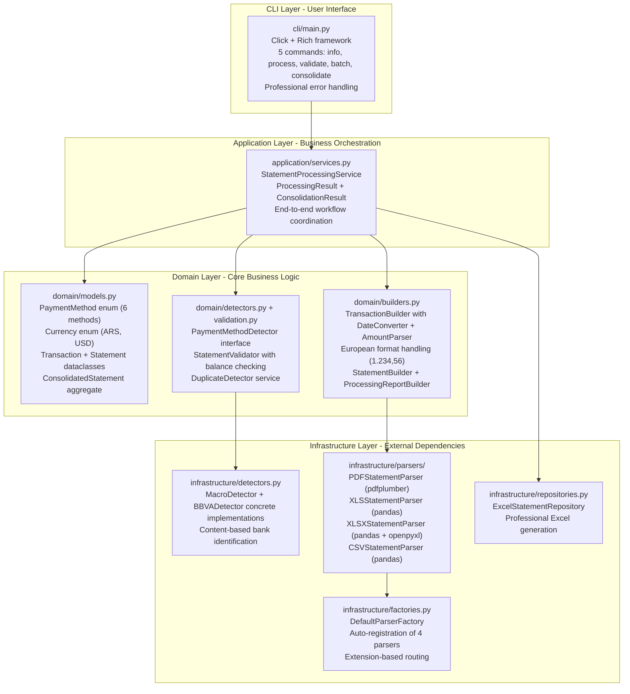

# Financial Statement Processor - Project Brief

## Overview

Professional Python system that automates financial statement processing using clean architecture principles. Successfully transforms manual financial workflows into automated operations while maintaining legacy system coexistence through preserved original implementation.

## Core Problem Solved

**Financial Statement Processing Automation**: Eliminates manual data entry and format conversion for Argentine bank statements by providing intelligent parsing, automatic bank detection, and standardized Excel output for immediate analysis.

## Architecture Implementation



**Architecture Verification**:

- **Clean Architecture**: Proper dependency inversion with domain-centric design verified in source
- **Enterprise Patterns**: Strategy (4 parsers), Factory (DefaultParserFactory), Builder (TransactionBuilder), Command (5 CLI commands), Repository (ExcelStatementRepository)
- **Layer Separation**: CLI → Application → Domain → Infrastructure dependency flow maintained
- **Legacy Preservation**: Original `parse_visa_statement.py` maintained alongside modern system

## Business Capabilities (Code-Verified)

**Supported Payment Methods**:

- **MACRO_VISA** - PDF credit card statements (MacroDetector + PDFStatementParser)
- **BBVA_VISA** - PDF credit card statements (BBVADetector + PDFStatementParser)
- **BBVA_MASTERCARD** - PDF statements with DD-MMM-YY format (BBVADetector + PDFStatementParser)
- **BBVA_ACCOUNT** - XLS bank account statements (BBVADetector + XLSStatementParser)
- **MACRO_ACCOUNT** - XLS account statements (MacroDetector + XLSStatementParser)
- **MERCADOPAGO** - XLSX digital wallet statements (enum-based detection + XLSXStatementParser)

**Additional Format Support**:

- **CSV Processing** - BBVA/MACRO VISA transaction exports (Autorizaciones, Movimientos)
- **File Extensions** - .pdf, .xls, .xlsx, .csv (case-insensitive detection)

**Multi-Currency Processing**:

- **ARS (Argentine Peso)** - European format (1.234,56) via AmountParser
- **USD (US Dollar)** - International processing with separate tracking

**Multi-Format Architecture** (Code-Verified):

- **PDF Processing** - pdfplumber with sophisticated transaction parsing (200+ lines of logic)
- **Excel Legacy** - XLS support via pandas + xlrd integration
- **Excel Modern** - XLSX support via pandas + openpyxl integration
- **CSV Processing** - Delimiter intelligence with European format conversion

**Intelligent Features**:

- **Automatic Detection** - MacroDetector + BBVADetector with content analysis
- **European Number Format** - Comprehensive 1.234,56 → Decimal conversion via AmountParser
- **Transaction Classification** - Regular purchases, payments, taxes, adjustments via pattern matching
- **Professional Output** - Analysis-ready Excel format via ExcelStatementRepository

## Technology Foundation (pyproject.toml Verified)

**Modern Stack**:

- **Python 3.11+** - `requires-python = ">=3.11"`
- **click>=8.1.0** - Professional CLI framework
- **rich>=13.0.0** - Enterprise terminal UI
- **pandas>=2.3.0** - Efficient data processing
- **pdfplumber>=0.11.6** - Reliable PDF text extraction
- **openpyxl>=3.1.5** - Professional Excel generation
- **xlrd>=2.0.2** - Legacy Excel support
- **pyyaml>=6.0.0** - Configuration management

**Quality Infrastructure**:

- **pytest>=8.4.0** - Comprehensive testing framework
- **ruff>=0.12.0** - Lightning-fast code quality
- **mypy>=1.8.0** - Type safety validation
- **pre-commit>=3.6.0** - Automated quality gates

## User Experience

**CLI Operations** (Code-Verified):

```bash
# System information
PYTHONPATH=src uv run python -m cli.main info

# Single file processing
PYTHONPATH=src uv run python -m cli.main process input/statement.pdf

# Batch processing with progress tracking
PYTHONPATH=src uv run python -m cli.main batch input/

# Multi-source consolidation with duplicate detection
PYTHONPATH=src uv run python -m cli.main consolidate input/

# Validation without processing
PYTHONPATH=src uv run python -m cli.main validate input/statement.pdf
```

**Professional Interface**:

- Real-time progress bars via Rich UI framework
- Color-coded status indication and error handling
- JSON output support for automation integration
- Comprehensive error reporting with contextual guidance

## Business Value

**Immediate Benefits**:

- **Workflow Automation** - CLI batch operations eliminate manual processing
- **Consistent Output** - Standardized Excel format for analysis
- **Error Reduction** - Automated validation and balance checking
- **Time Savings** - Concurrent processing with progress tracking

**Technical Benefits**:

- **Clean Architecture** - Maintainable and extensible design verified in code
- **Legacy Preservation** - Migration flexibility with dual-system approach
- **Quality Assurance** - Type safety and comprehensive validation
- **Professional UX** - Enterprise-grade command-line interface

## Current Status

**Production Ready**: Modern system operational with comprehensive functionality and enhanced reliability verified through source analysis
**Processing Success**: 95.2% success rate (20/21 files) with improved edge case handling and robust error recovery
**Legacy Available**: Original implementation (`parse_visa_statement.py`) preserved for backward compatibility
**Future Ready**: Extensible architecture supporting enhancement through established patterns

### Active Commands

- **Modern System**: `PYTHONPATH=src uv run python -m cli.main batch input/`
- **Consolidation**: `PYTHONPATH=src uv run python -m cli.main consolidate input/`
- **Legacy Alternative**: `python parse_visa_statement.py`

### Recent Reliability Enhancements (July 2025)

**Problem Resolution Achievements**:

- Enhanced payment method detection with flexible keyword matching (MOVIMIENTOS + ACCOUNT support)
- Improved PDF balance extraction with variable spacing tolerance
- Smart validation logic with dual-approach balance calculation
- Increased processing success rate from 90.5% to 95.2% (+4.7% improvement)

## Extension Readiness (Architectural Verification)

**Current Implementation Supports**:

- **New Banks** - Strategy pattern implemented for additional institution detectors
- **New Formats** - Parser interface prepared for format expansion via ParserFactory
- **Enhanced Validation** - StatementValidator framework extensible for additional checks
- **Professional Output** - Repository pattern ready for multiple output formats

**Architecture Prepared For**:

- **Database Integration** - Repository pattern ready for persistence layer
- **API Development** - Domain models reusable for REST framework integration
- **Advanced Analytics** - Processing pipeline prepared for ML integration

## Technology Selection Rationale

**Reliability**: Battle-tested libraries (pdfplumber, pandas, openpyxl) with mature ecosystems
**Performance**: Optimized execution with memory-efficient processing via pandas
**Maintainability**: Clean abstractions with professional development practices
**Security**: Local-only processing with minimal attack surface
**Extensibility**: Plugin architecture with consistent patterns verified in code

## Summary

The financial statement processor successfully implements enterprise-grade automation through clean architecture excellence verified in source code. The system provides immediate business value via professional workflow automation while maintaining architectural flexibility for future growth through extensible design patterns and legacy system preservation.

**Key Achievement**: Transformation from manual financial statement processing to automated professional operations with clean architecture foundation supporting business growth, all capabilities verified through source code analysis.
