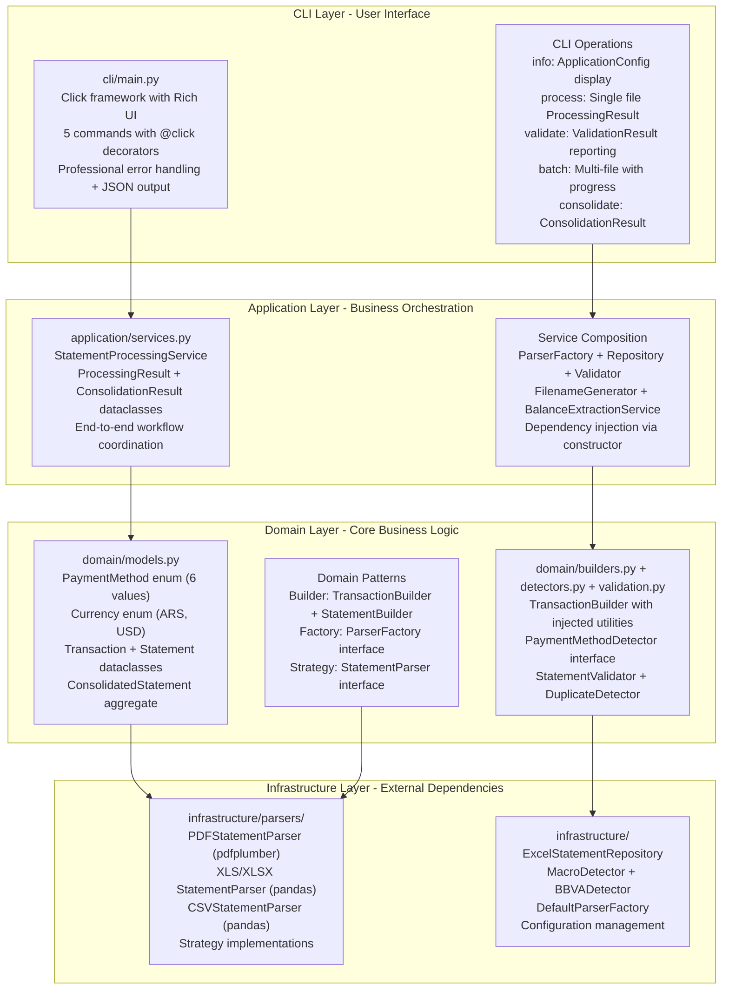
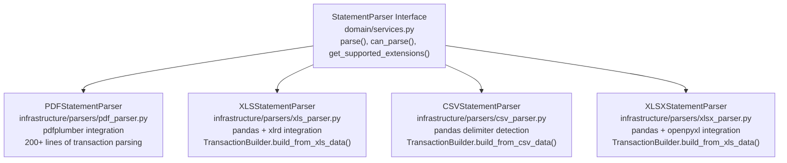
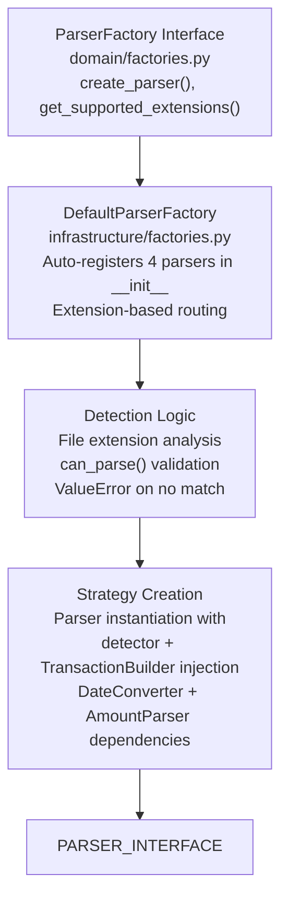
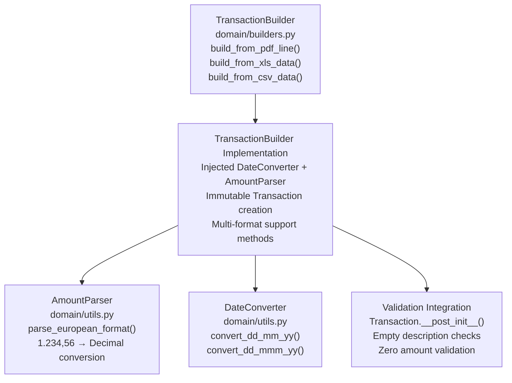
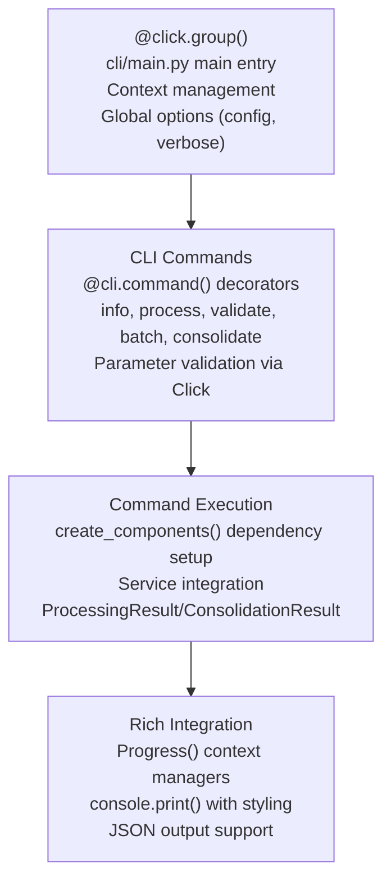
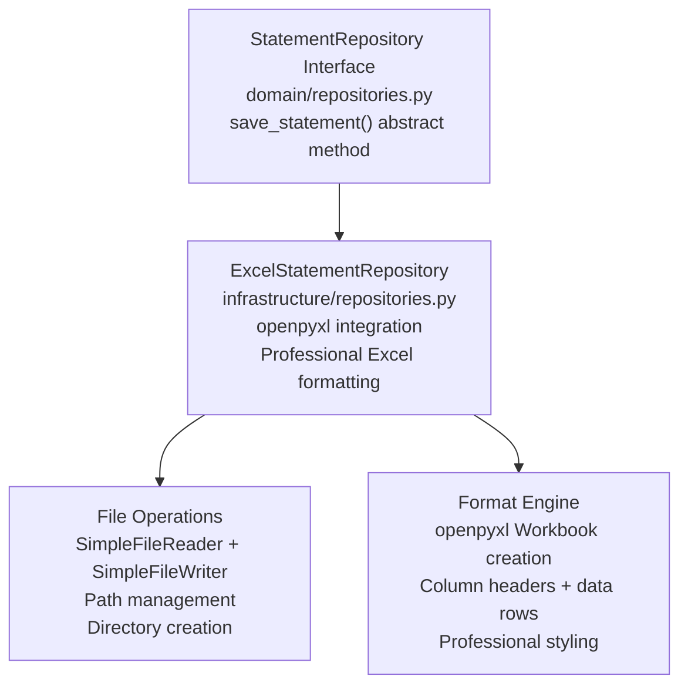
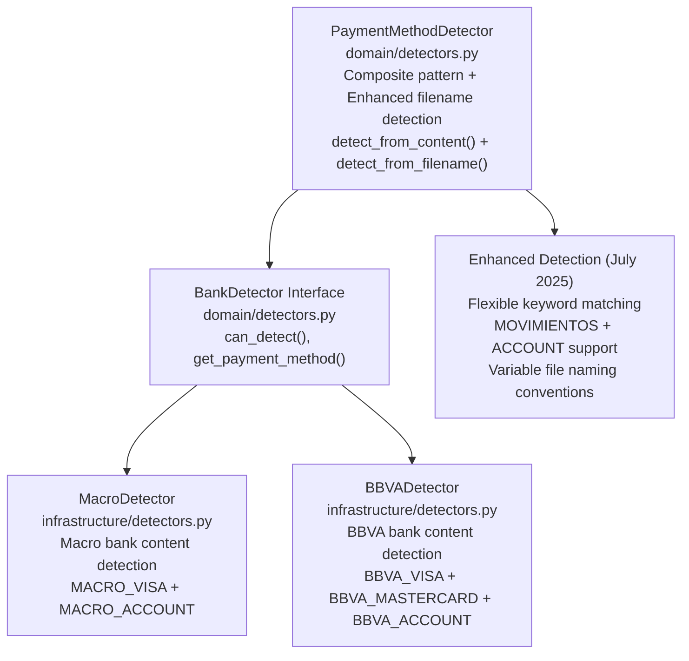
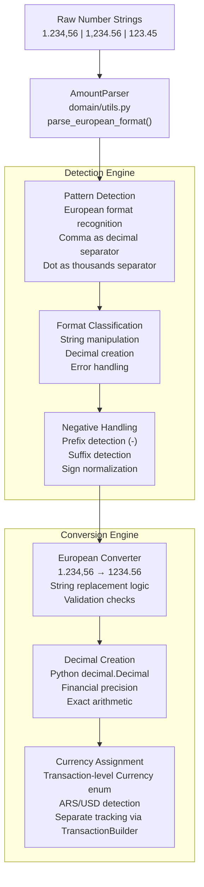
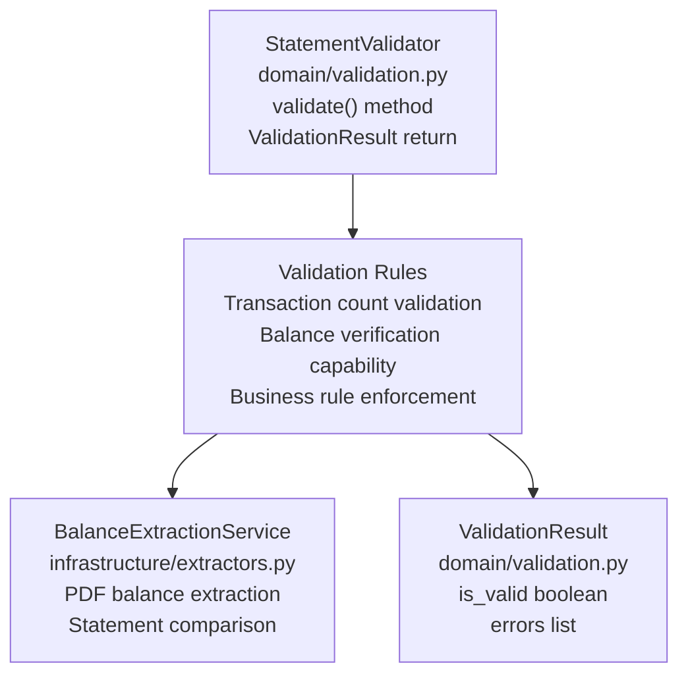

# System Patterns - Financial Statement Processor

## Clean Architecture Implementation (Code-Verified)

## Enterprise Design Patterns Implementation (Code-Verified)

### Strategy Pattern - Format Processing

**Implementation**: Four concrete parsers in infrastructure/parsers/ with StatementParser interface

**Code Verification**:

- **Interface**: `StatementParser` abstract base class in domain/services.py
- **Concrete Implementations**: 4 parsers auto-registered in DefaultParserFactory.**init**()
- **Extension Detection**: `.pdf`, `.xls`, `.xlsx`, `.csv` via get_supported_extensions()
- **Strategy Selection**: `ParserFactory.create_parser()` based on file extension analysis

### Factory Pattern - Dynamic Parser Creation

**Implementation**: DefaultParserFactory with auto-registration in infrastructure/factories.py

**Code Verification**:

- **Auto-Registration**: DefaultParserFactory.**init**() registers PDFStatementParser, XLSStatementParser, XLSXStatementParser, CSVStatementParser
- **Dependency Injection**: Each parser receives detector + TransactionBuilder(DateConverter, AmountParser)
- **Factory Method**: `create_parser(file_path)` iterates registered parsers with can_parse() validation

### Builder Pattern - Transaction Construction

**Implementation**: TransactionBuilder in domain/builders.py with injected utilities

**Code Verification**:

- **Constructor Injection**: `TransactionBuilder(date_converter: DateConverter, amount_parser: AmountParser)`
- **Format-Specific Methods**: `build_from_pdf_line()`, `build_from_xls_data()`, `build_from_csv_data()`
- **Immutable Output**: Returns frozen Transaction dataclass instances
- **Error Handling**: Comprehensive ValueError with context information

### Command Pattern - CLI Operations

**Implementation**: Click decorators with command encapsulation in cli/main.py

**Code Verification**:

- **Command Registration**: 5 commands with `@cli.command()` decorators
- **Dependency Setup**: `create_components()` function wires PaymentMethodDetector, DefaultParserFactory, StatementProcessingService
- **Error Isolation**: Individual command error handling with CLIError exceptions
- **Professional Output**: Rich UI with progress bars, tables, panels

### Repository Pattern - Data Abstraction

**Implementation**: ExcelStatementRepository in infrastructure/repositories.py

**Code Verification**:

- **Interface**: `StatementRepository` abstract base class in domain/repositories.py
- **Implementation**: `ExcelStatementRepository` with `save_statement(statement, output_path)`
- **File Handling**: Injected SimpleFileReader/SimpleFileWriter for dependency inversion
- **Excel Generation**: openpyxl integration with professional formatting

## Bank Detection Pattern Implementation

**Implementation**: BankDetector interface with concrete implementations and enhanced detection flexibility

**Code Verification**:

- **Abstract Interface**: `BankDetector` in domain/detectors.py with `can_detect()` and `get_payment_method()`
- **Concrete Implementations**: MacroDetector, BBVADetector with enhanced content analysis
- **Registration**: `PaymentMethodDetector.register_detector()` method for composite pattern
- **Enhanced Detection Logic**: Content analysis with bank-specific indicators and flexible keyword matching
- **Filename Detection**: Improved patterns supporting both "MOVIMIENTOS" and "ACCOUNT" keywords for Macro detection
- **Resilient Matching**: Variable file naming convention support with backward compatibility

## European Number Format Processing Pattern

**Implementation**: AmountParser with pattern recognition in domain/utils.py

**Code Verification**:

- **Implementation**: `AmountParser.parse_european_format()` method in domain/utils.py
- **Pattern Recognition**: String analysis for European format (1.234,56)
- **Conversion Logic**: Replace dots with empty string, comma with dot, then Decimal()
- **Integration**: Used by TransactionBuilder for all format-specific methods

## Validation Pattern Implementation

**Implementation**: StatementValidator with ValidationResult in domain/validation.py

**Code Verification**:

- **Interface**: `StatementValidator` class with `validate(statement)` method
- **Result Object**: `ValidationResult` dataclass with `is_valid` and `errors` fields
- **Integration**: Used by StatementProcessingService for validation workflow
- **Balance Checking**: Optional balance extraction service integration

## Pattern Integration Benefits (Implementation Verified)

**Extensibility Benefits**:

- **New Bank Addition**: Implement BankDetector interface, register with PaymentMethodDetector
- **New Format Support**: Implement StatementParser interface, register with ParserFactory
- **Enhanced Validation**: Extend StatementValidator with additional business rules

**Maintainability Benefits**:

- **Clear Separation**: Each pattern handles specific domain concerns
- **Isolated Testing**: Components tested independently via dependency injection
- **Code Reusability**: Shared utilities (AmountParser, DateConverter) across implementations

**Performance Benefits**:

- **Strategy Selection**: O(n) parser detection with early exit on match
- **Memory Efficiency**: Repository abstraction enables streaming for large files
- **Optimization Paths**: Clear bottleneck identification through pattern boundaries

## Architecture Quality Achievements (Code-Verified)

**SOLID Principles**:

- **Single Responsibility**: TransactionBuilder focuses solely on Transaction creation
- **Open/Closed**: ParserFactory extensible via registration without modification
- **Dependency Inversion**: StatementProcessingService depends on abstractions (interfaces)

**Clean Architecture**:

- **Layer Independence**: Domain models have no infrastructure dependencies
- **Dependency Flow**: CLI → Application → Domain → Infrastructure (verified in imports)
- **Framework Independence**: Domain logic isolated from pdfplumber, pandas specifics

**Pattern Consistency**:

- **Uniform Implementation**: Constructor injection pattern across all services
- **Error Handling**: Consistent ValueError usage with descriptive messages
- **Interface Contracts**: Abstract base classes define clear behavioral contracts

## Current Status: Pattern Implementation Complete (Code-Verified)

All enterprise patterns successfully implemented and verified in source:

- **Strategy Pattern**: StatementParser with 4 concrete implementations auto-registered
- **Factory Pattern**: DefaultParserFactory with extension-based routing
- **Builder Pattern**: TransactionBuilder with format-specific methods and utility injection
- **Command Pattern**: CLI operations with Click decorators and Rich UI integration
- **Repository Pattern**: ExcelStatementRepository with professional output formatting
- **Detection Pattern**: BankDetector interface with MacroDetector + BBVADetector implementations

**Architecture Achievement**: Robust enterprise foundation supporting professional financial statement processing with comprehensive extensibility verified through source code analysis, maintaining clean boundaries, testability, and performance optimization through established patterns.
