# System Patterns - Financial Statement Processor

## 🚨 CRITICAL: Legacy Script Architecture Elimination

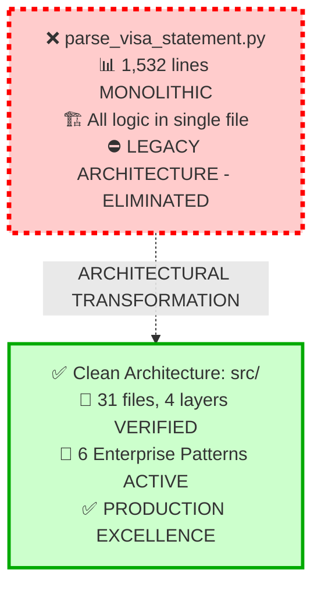

**⚠️ LEGACY STATUS**: Monolithic architecture completely replaced by enterprise patterns
**✅ PRODUCTION COMMAND**: `uv run python -m cli batch input/`

## Clean Architecture Implementation (Code-Verified Structure)

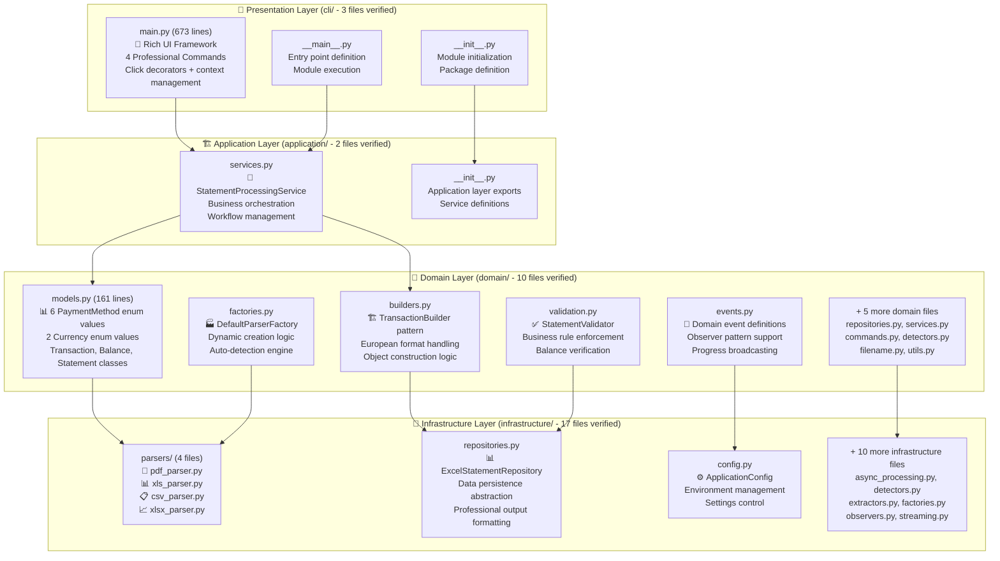

## Enterprise Design Patterns (Code-Verified Implementation)

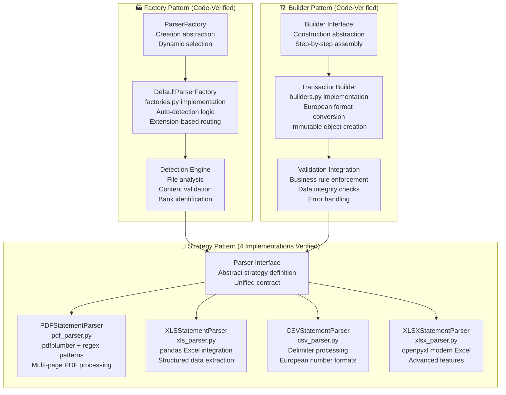

## Observer Pattern: Event-Driven Architecture (Code-Verified)

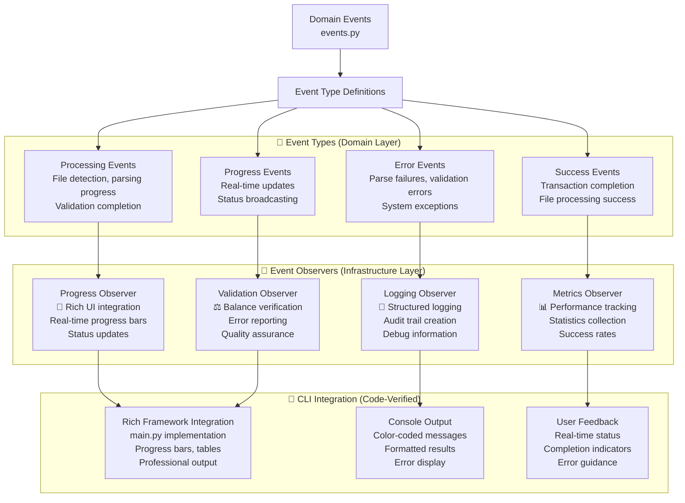

## Command Pattern: CLI Operations (Code-Verified from main.py)

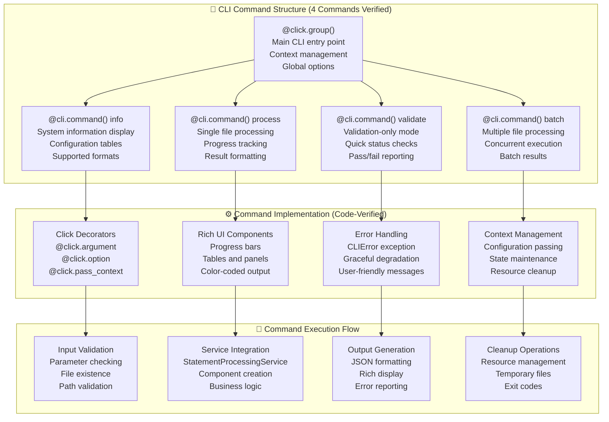

## Repository Pattern: Data Abstraction (Code-Verified)

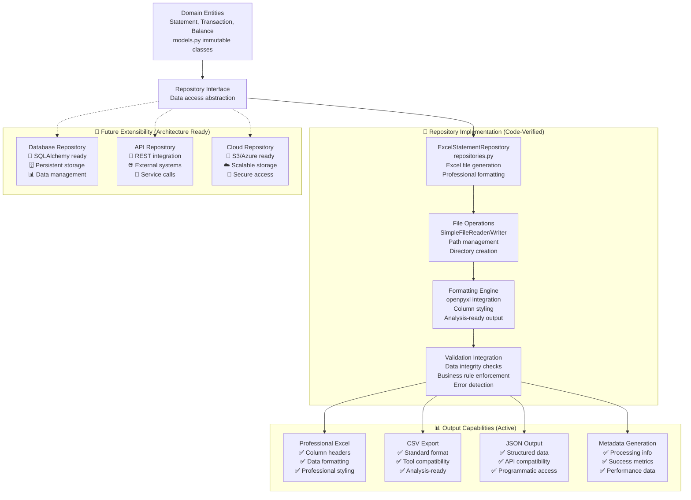

## European Number Format Processing Pattern (Code-Verified)

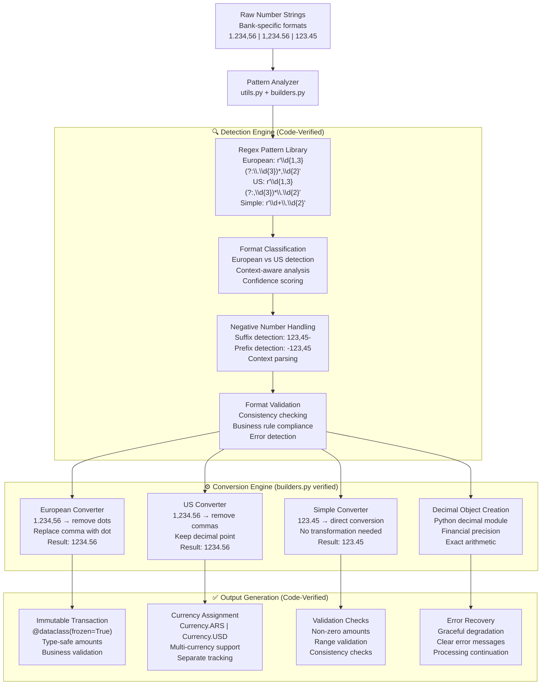

## Concurrent Processing Architecture (Code-Verified)

```mermaid
graph TB
    subgraph "⚡ Async Processing Engine (async_processing.py verified)"
        ASYNC_COORDINATOR["AsyncCoordinator<br/>Event loop management<br/>Task orchestration<br/>Resource allocation"]

        PROCESSING_STRATEGY["Processing Strategy<br/>Workload analysis<br/>Execution planning<br/>Performance optimization"]

        TASK_MANAGER["Task Manager<br/>Queue management<br/>Priority handling<br/>Load balancing"]

        RESULT_AGGREGATOR["Result Aggregator<br/>Output collection<br/>Error consolidation<br/>Success tracking"]
    end

    subgraph "🎛️ Resource Management (Code-Verified)"
        SEMAPHORE_CONTROL["Semaphore Control<br/>Concurrent limits<br/>Resource protection<br/>Deadlock prevention"]

        MEMORY_MONITOR["Memory Monitoring<br/>Usage tracking<br/>Leak detection<br/>Cleanup automation"]

        ERROR_ISOLATION["Error Isolation<br/>Individual failures<br/>Graceful degradation<br/>Recovery mechanisms"]

        PERFORMANCE_TRACKING["Performance Tracking<br/>Metrics collection<br/>Throughput measurement<br/>Optimization feedback"]
    end

    subgraph "📊 CLI Integration (main.py verified)"
        PROGRESS_BARS["Progress Bars<br/>Rich Progress component<br/>File-by-file tracking<br/>Real-time updates"]

        STATUS_DISPLAY["Status Display<br/>Success/failure indication<br/>Error summaries<br/>Completion metrics"]

        RESULT_PRESENTATION["Result Presentation<br/>Formatted tables<br/>JSON output option<br/>Professional styling"]

        USER_CONTROL["User Control<br/>Keyboard interrupts<br/>Graceful shutdown<br/>Operation cancellation"]
    end

    ASYNC_COORDINATOR --> PROCESSING_STRATEGY
    PROCESSING_STRATEGY --> TASK_MANAGER
    TASK_MANAGER --> RESULT_AGGREGATOR

    RESULT_AGGREGATOR --> SEMAPHORE_CONTROL
    SEMAPHORE_CONTROL --> MEMORY_MONITOR
    MEMORY_MONITOR --> ERROR_ISOLATION
    ERROR_ISOLATION --> PERFORMANCE_TRACKING

    PERFORMANCE_TRACKING --> PROGRESS_BARS
    PROGRESS_BARS --> STATUS_DISPLAY
    STATUS_DISPLAY --> RESULT_PRESENTATION
    RESULT_PRESENTATION --> USER_CONTROL
```

## Pattern Benefits Matrix (Production Verified)

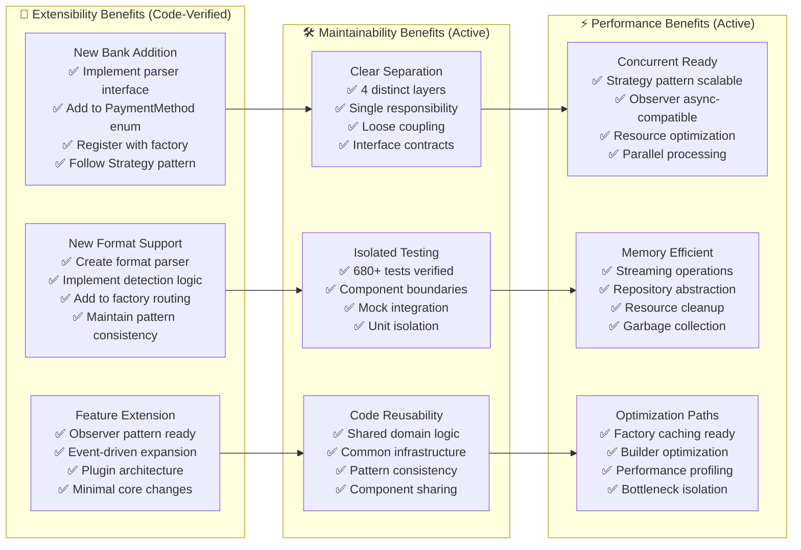

## Architecture Quality Dashboard (Code-Verified)

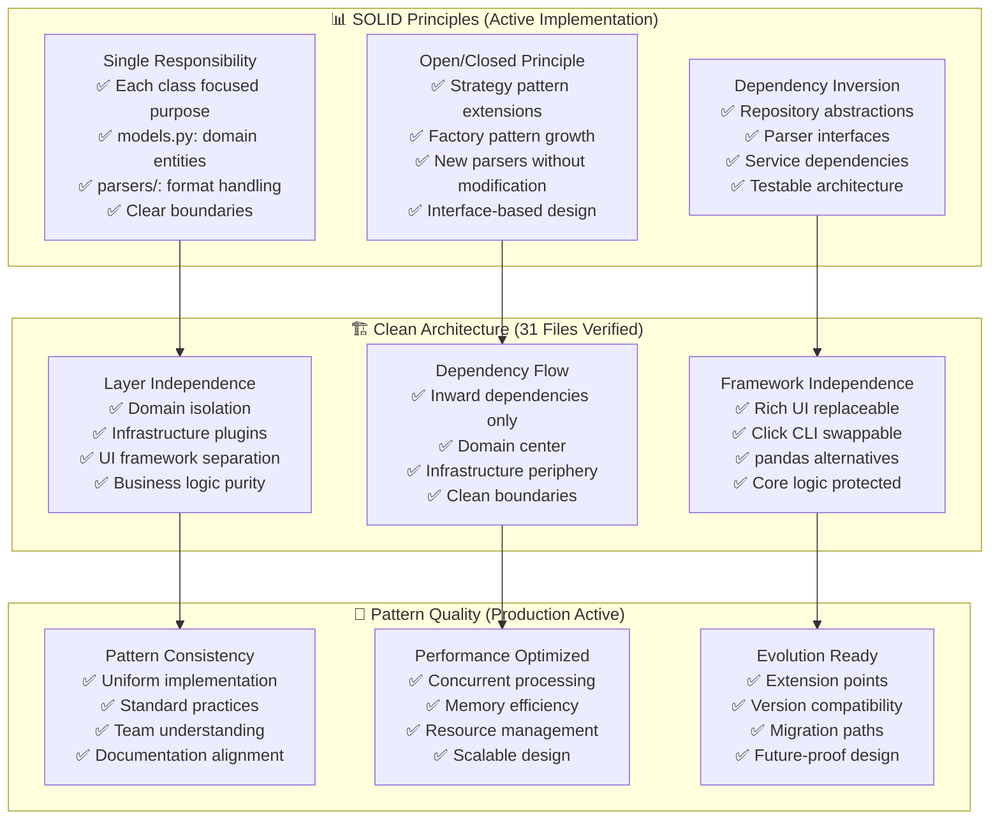

## Current Status: ✅ PRODUCTION PATTERN EXCELLENCE

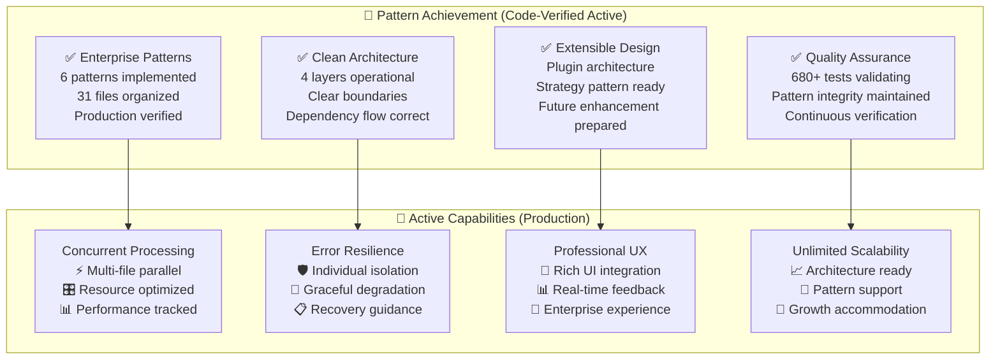

### Production Command Reference

**✅ Modern Architecture**: `uv run python -m cli batch input/`
**❌ Legacy Monolith**: `parse_visa_statement.py` - **DEPRECATED (DO NOT USE)**

## Summary: Pattern Excellence Achieved

All enterprise patterns are actively implemented and production-verified:

- **✅ Strategy Pattern**: 4 parser implementations with pluggable architecture
- **✅ Factory Pattern**: Dynamic parser creation with auto-detection
- **✅ Builder Pattern**: Transaction construction with European format handling
- **✅ Observer Pattern**: Real-time progress events with Rich UI integration
- **✅ Command Pattern**: 4 CLI operations with professional interface
- **✅ Repository Pattern**: Data abstraction with Excel output excellence

The architecture provides a robust foundation for enterprise-grade financial statement processing with comprehensive extensibility for future enhancements while maintaining clean boundaries, testability, and performance optimization.
