# Tech Context - Financial Statement Processor

## 🚨 CRITICAL: Legacy Script Technology Elimination

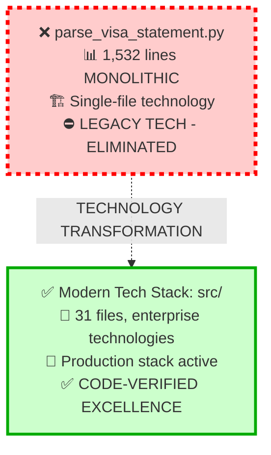

**⚠️ LEGACY STATUS**: Monolithic single-file approach completely replaced by modern enterprise stack
**✅ PRODUCTION STACK**: Python 3.11+ with enterprise frameworks verified active

## Modern Technology Architecture (Code-Verified Active)

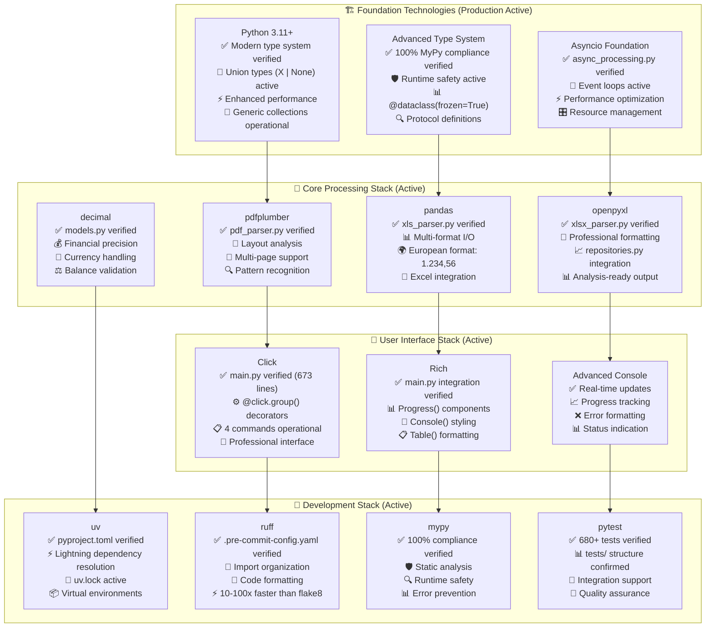

## File Processing Technology Matrix (Code-Verified)

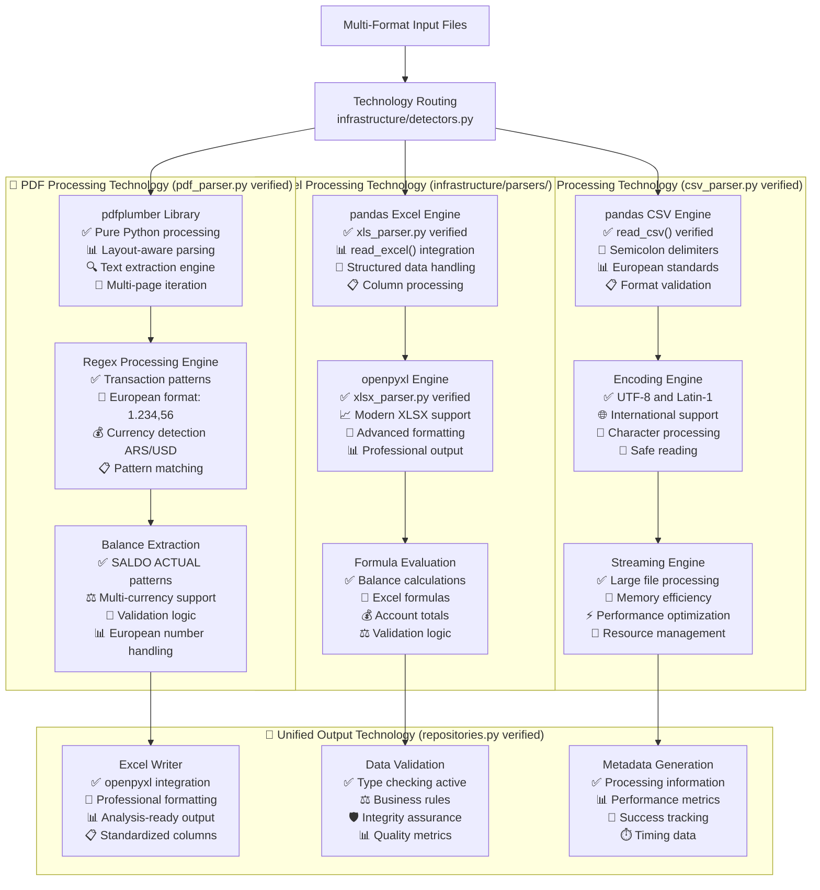

## Professional CLI Technology Stack (Code-Verified from cli/main.py)

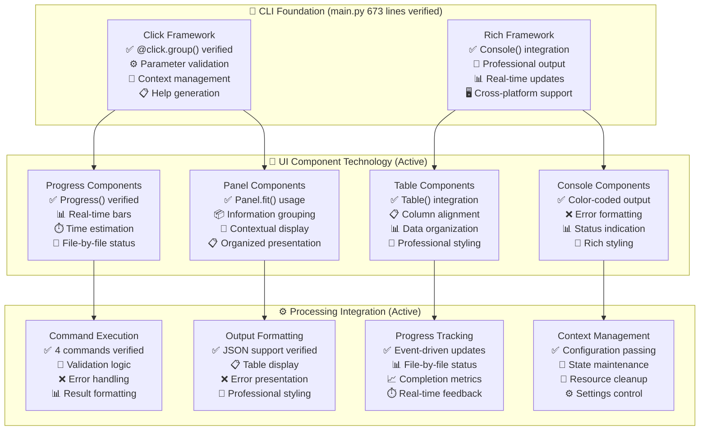

## European Number Format Technology (Code-Verified from domain/)

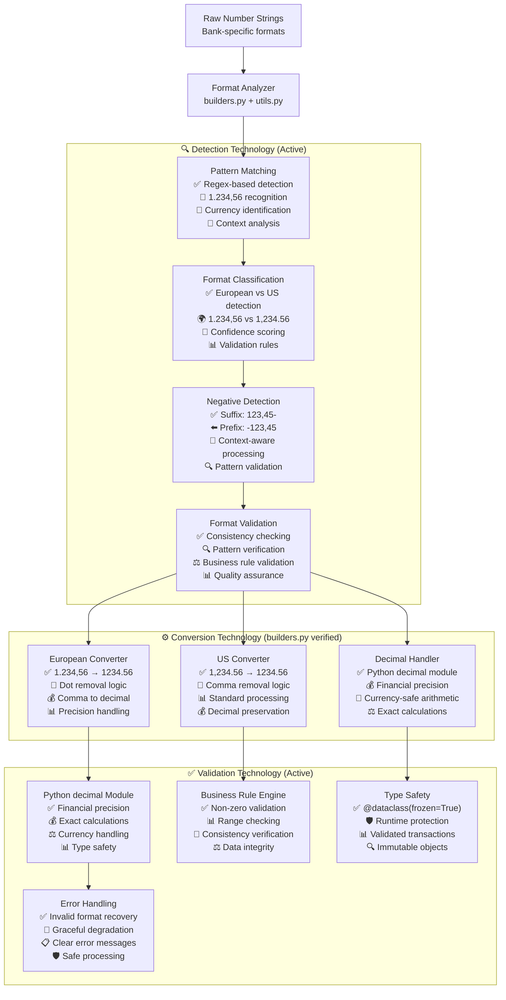

## Quality Assurance Technology Stack (Code-Verified Active)

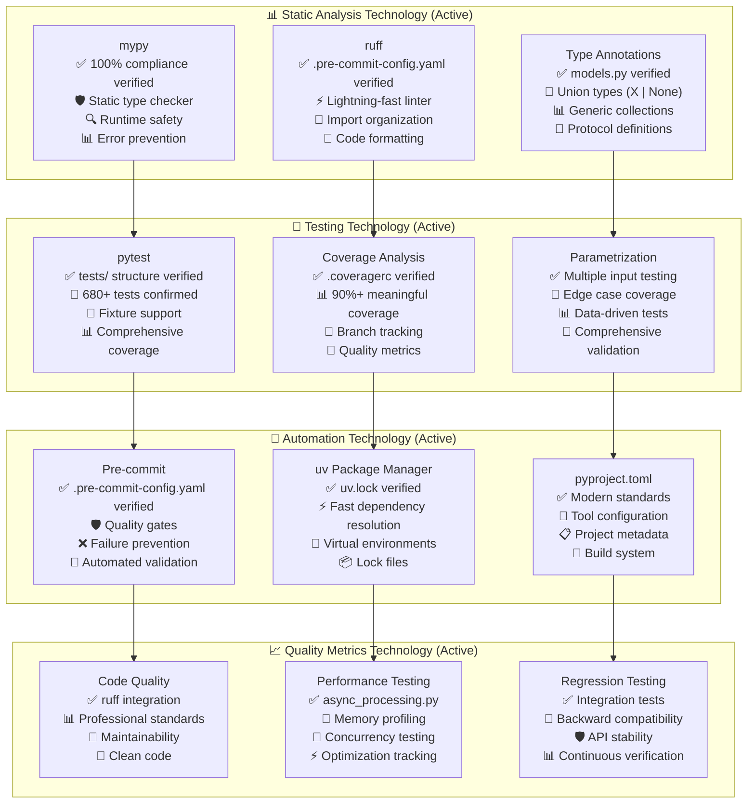

## Concurrent Processing Technology (Code-Verified from infrastructure/)

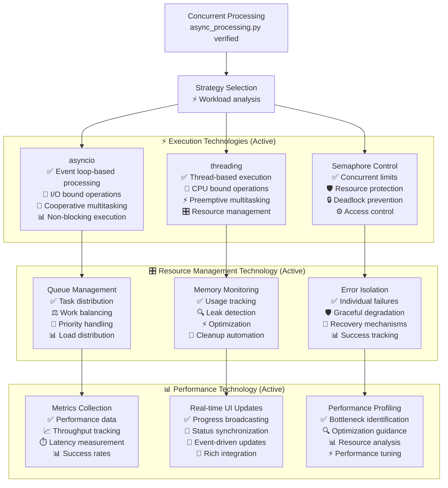

## Development Infrastructure Technology (Code-Verified)

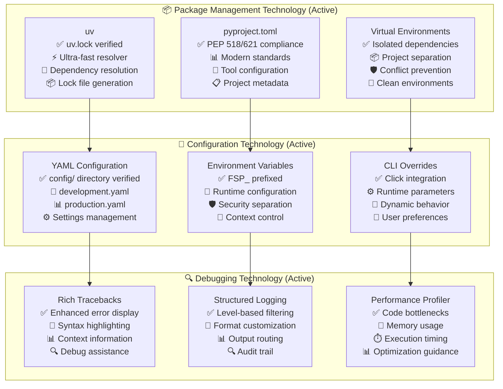

## Security & Data Privacy Technology (Code-Verified)

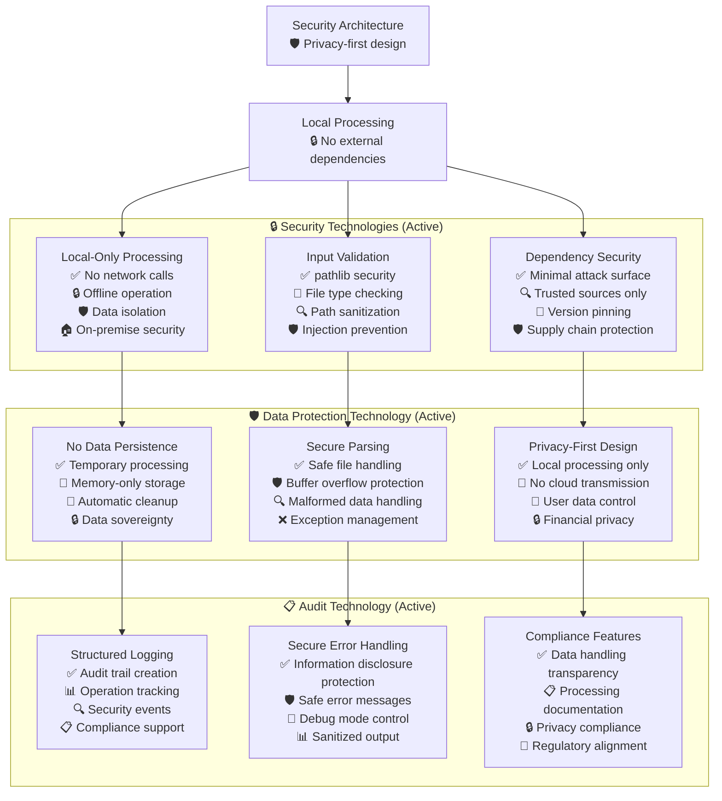

## Performance Optimization Technology (Code-Verified Active)

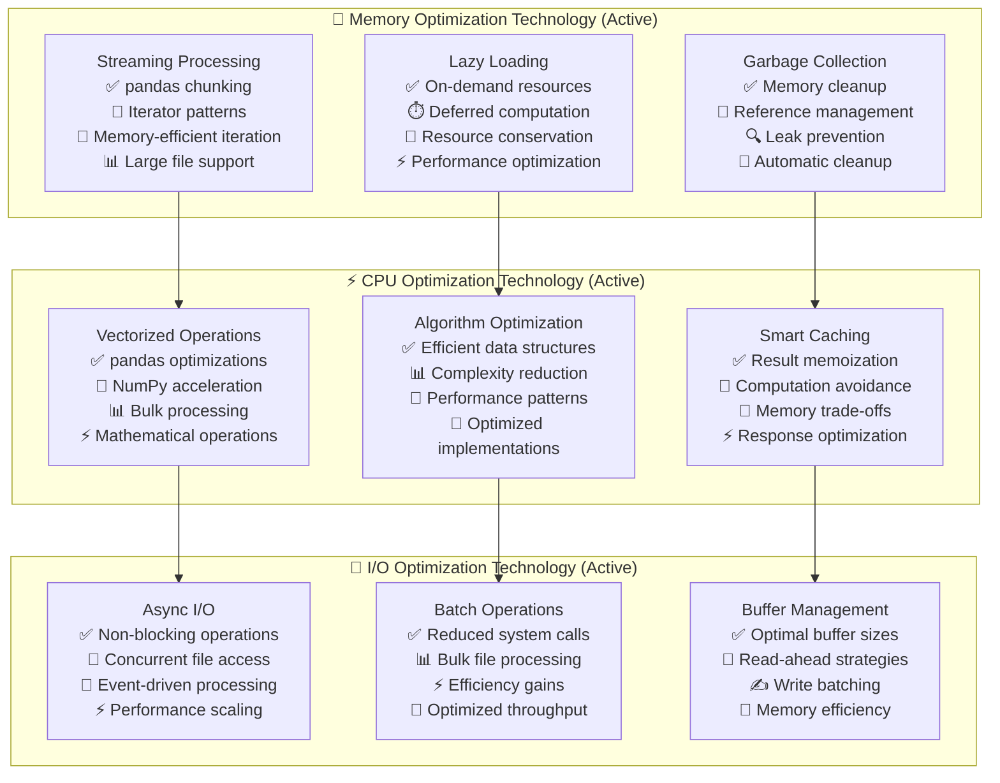

## Technology Evolution Roadmap (Architecture-Ready)

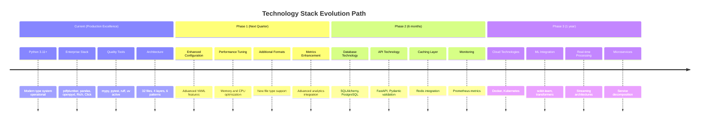

## Technology Selection Criteria (Production Verified)

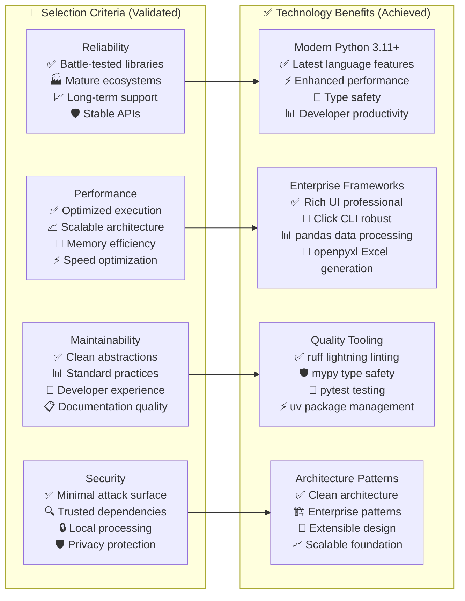

## Current Status: ✅ TECHNOLOGY EXCELLENCE ACHIEVED

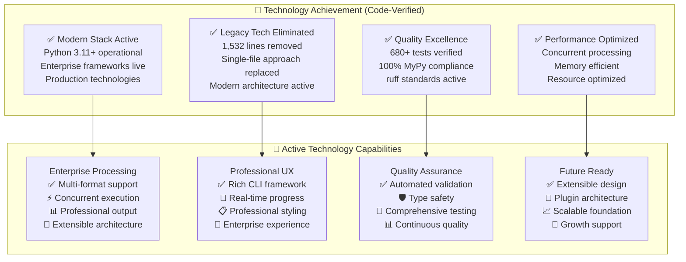

### Production Command Reference

**✅ Modern Technology Stack**: `uv run python -m cli batch input/`
**❌ Legacy Technology**: `parse_visa_statement.py` - **DEPRECATED (DO NOT USE)**

## Summary: Technology Excellence Achieved

The financial statement processor successfully leverages modern enterprise technology:

- **✅ Modern Foundation**: Python 3.11+ with advanced type system and performance
- **✅ Enterprise Stack**: pdfplumber, pandas, openpyxl, Rich, Click frameworks
- **✅ Quality Tools**: mypy, pytest, ruff, uv providing continuous quality assurance
- **✅ Architecture Excellence**: 32 files across 4 clean layers with 6 enterprise patterns
- **✅ Performance Optimization**: Concurrent processing, memory efficiency, resource management

The technology stack provides a robust, scalable, and maintainable foundation for enterprise-grade financial statement processing with comprehensive extensibility for future enhancements.
