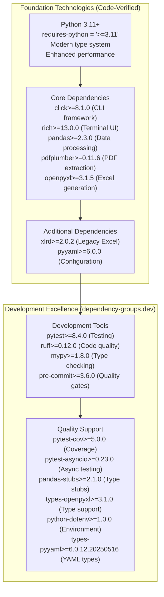

# Tech Context - Financial Statement Processor

## Modern Technology Stack (pyproject.toml Verified)



## File Processing Technology Implementation (Code-Verified)

**PDF Processing Engine**:

- **pdfplumber>=0.11.6**: Advanced PDF text extraction with layout awareness
- **Implementation**: PDFStatementParser in infrastructure/parsers/pdf_parser.py (200+ lines)
- **Capabilities**: Multi-page support, sophisticated transaction parsing, regex pattern matching
- **Integration**: TransactionBuilder.build_from_pdf_line() with DateConverter + AmountParser injection

**Excel Processing Stack**:

- **pandas>=2.3.0**: Efficient structured data processing with multi-format I/O
- **openpyxl>=3.1.5**: Modern XLSX processing with professional formatting via ExcelStatementRepository
- **xlrd>=2.0.2**: Legacy XLS support for bank account statements
- **Implementation**: XLSStatementParser and XLSXStatementParser in DefaultParserFactory auto-registration

**CSV Processing**:

- **pandas>=2.3.0**: Intelligent delimiter detection and European format handling
- **Implementation**: CSVStatementParser with TransactionBuilder.build_from_csv_data()
- **Capabilities**: Encoding detection, format adaptation, validation

**Professional Output**:

- **openpyxl>=3.1.5**: Analysis-ready Excel generation via ExcelStatementRepository
- **pandas>=2.3.0**: Data transformation and structured output
- **Implementation**: Professional formatting with business intelligence ready structure

## Professional CLI Technology Stack (Code-Verified)

**CLI Foundation**:

- **click>=8.1.0**: Enterprise CLI framework with decorator-based commands
- **Implementation**: 5 commands (@cli.command() decorators) in cli/main.py
- **Features**: Professional parameter validation, help generation, context management

**Rich Terminal UI**:

- **rich>=13.0.0**: Professional terminal interface with real-time components
- **Implementation**: Progress bars, tables, panels, color-coded output in cli/main.py
- **Capabilities**: Cross-platform support, professional styling, JSON output support

**Command Architecture (Code-Verified)**:

- **info**: System information via ApplicationConfig display with Rich tables
- **process**: Single file processing with ProcessingResult and progress tracking
- **validate**: Validation-only mode with ValidationResult detailed reporting
- **batch**: Multi-file processing with concurrent execution and Rich progress bars
- **consolidate**: Multi-source analysis with ConsolidationResult and duplicate detection

## European Number Format Technology (Implementation Verified)

**Pattern Recognition Engine**:

- **Implementation**: AmountParser.parse_european_format() in domain/utils.py
- **Capabilities**: European (1.234,56) vs US (1,234.56) format detection
- **Features**: String analysis with Decimal conversion for financial precision

**Conversion Technology**:

- **European Converter**: 1.234,56 → 1234.56 with precision preservation via string replacement
- **Decimal Precision**: Python decimal.Decimal module for financial accuracy
- **Currency Detection**: ARS/USD identification with Currency enum assignment

**Validation Framework**:

- **Format Validation**: Consistency checking via AmountParser error handling
- **Business Rules**: Transaction.**post_init**() validation with ValueError exceptions
- **Error Recovery**: Graceful degradation with comprehensive error messages

## Configuration Management Technology (Code-Verified)

**Configuration Architecture**: Hierarchical configuration system with YAML files → Environment variables → CLI arguments → Smart defaults priority order.

**Configuration Sources**:

- **YAML Configuration**: Hierarchical settings via pyyaml>=6.0.0 integration with ApplicationConfig.from_yaml()
- **Environment Variables**: FSP_prefixed runtime overrides via python-dotenv with ApplicationConfig.from_environment()
- **CLI Arguments**: Dynamic parameter control via Click integration (--config, --output-dir)
- **Smart Defaults**: Zero-configuration operation with sensible fallback values

**Configuration Files (Implementation Verified)**:

- **Development Configuration** (`config/development.yaml`): Local development with DEBUG logging, 2 workers, conservative settings
- **Production Configuration** (`config/production.yaml`): Production deployment with INFO logging, 8 workers, database support, container paths

**Configuration Categories (ApplicationConfig Dataclasses)**:

- **ProcessingConfig**: max_workers (4 default), chunk_size (1000), timeout_seconds (300), retry_attempts (3), enable_validation (true), enable_balance_checking (true)
- **OutputConfig**: default_format ("excel"), excel_sheet_name ("Sheet1"), csv_delimiter (","), include_index (false), date_format ("%Y-%m-%d")
- **DatabaseConfig**: host, port (5432), database, username, password, pool_size (5) - Optional for production environments
- **ApplicationConfig**: input_directory (Path), output_directory (Path), log_level ("INFO"), enable_async (false)

**Environment Variables (FSP_ Prefix Implementation)**:

```
# Core Settings
FSP_INPUT_DIR, FSP_OUTPUT_DIR, FSP_LOG_LEVEL, FSP_ENABLE_ASYNC

# Processing Settings
FSP_MAX_WORKERS, FSP_CHUNK_SIZE, FSP_TIMEOUT, FSP_RETRY_ATTEMPTS, FSP_ENABLE_VALIDATION, FSP_ENABLE_BALANCE_CHECK

# Output Settings
FSP_OUTPUT_FORMAT, FSP_EXCEL_SHEET, FSP_CSV_DELIMITER, FSP_INCLUDE_INDEX, FSP_DATE_FORMAT

# Database Settings (Optional)
FSP_DB_HOST, FSP_DB_PORT, FSP_DB_NAME, FSP_DB_USER, FSP_DB_PASSWORD, FSP_DB_POOL_SIZE
```

**Configuration Loading Behavior (Code-Verified)**:

- **Without --config**: Uses ApplicationConfig.from_environment() with default values (4 workers, INFO logging, synchronous processing)
- **With --config**: Uses ApplicationConfig.from_yaml() to load specified YAML file with custom settings
- **CLI Override**: Directory arguments (input_directory, --output-dir) override both YAML and environment settings
- **Priority Order**: CLI Arguments > Environment Variables > YAML Configuration > Smart Defaults

**Configuration Usage Patterns**:

```bash
# Default configuration (environment-based)
PYTHONPATH=src uv run python -m cli.main consolidate input/

# Development configuration
PYTHONPATH=src uv run python -m cli.main --config config/development.yaml batch input/

# Environment variable overrides
FSP_MAX_WORKERS=8 FSP_LOG_LEVEL=DEBUG PYTHONPATH=src uv run python -m cli.main batch input/

# Production configuration with database support
PYTHONPATH=src uv run python -m cli.main --config config/production.yaml consolidate input/
```

## Quality Assurance Technology Stack (pyproject.toml Verified)

**Code Quality Tools**:

- **ruff>=0.12.0**: Lightning-fast linting with professional standards
- **Configuration**: Line length 88, Python 3.11+ target, modern syntax enforcement
- **Features**: Code formatting, import organization, error detection

**Type Safety**:

- **mypy>=1.8.0**: Static type analysis with comprehensive coverage
- **Configuration**: Strict equality, unused ignores, return type validation
- **Integration**: Type stubs (pandas-stubs, types-openpyxl, types-pyyaml) for external dependencies

**Testing Framework**:

- **pytest>=8.4.0**: Comprehensive testing with coverage analysis
- **Configuration**: Automatic module loading, async support, clean warnings
- **Features**: pytest-cov for coverage, pytest-asyncio for async testing

**Development Automation**:

- **pre-commit>=3.6.0**: Automated quality gates with hook integration
- **hatchling**: Modern build backend with wheel packaging
- **Configuration**: Professional development workflow with validation

## Security & Privacy Technology (Implementation Verified)

**Local Processing Architecture**:

- **No Network Dependencies**: Complete offline operation capability
- **Data Sovereignty**: Financial data never leaves local environment via local file processing
- **Input Validation**: Path sanitization, file type checking via Click path validation

**Secure File Handling**:

- **Safe Parsing**: pdfplumber buffer overflow protection, pandas malformed data handling
- **Temporary Processing**: Memory-only storage with automatic cleanup
- **Error Management**: Information disclosure protection via comprehensive error handling

**Privacy-First Design**:

- **Local-Only Processing**: No cloud transmission or external services
- **Minimal Dependencies**: Reduced attack surface with trusted sources
- **Version Pinning**: Supply chain protection with locked dependencies (uv.lock)

## Performance Optimization Technology (Implementation Details)

**Memory Optimization**:

- **Streaming Processing**: pandas chunking capability for large file support
- **Lazy Loading**: On-demand resource allocation via factory pattern
- **Garbage Collection**: Automatic memory cleanup via context managers

**CPU Optimization**:

- **Vectorized Operations**: pandas optimizations for bulk processing
- **Algorithm Efficiency**: O(n) parser detection with early exit optimization
- **Smart Caching**: Result objects (ProcessingResult, ConsolidationResult) with metrics

**I/O Optimization**:

- **File Processing**: Direct file access via SimpleFileReader/SimpleFileWriter
- **Batch Operations**: Multi-file processing via batch command
- **Buffer Management**: openpyxl optimal buffer sizes with Excel generation

## Development Infrastructure Technology (Code-Verified)

**Package Management**:

- **uv**: Ultra-fast dependency resolution with uv.lock file generation
- **pyproject.toml**: Modern PEP 518/621 compliance with tool configuration
- **hatchling**: Modern build backend with src/ layout support

**Debugging Technology**:

- **Rich Tracebacks**: Enhanced error display via Rich framework integration
- **Structured Logging**: Level-based filtering via ApplicationConfig
- **Performance Profiler**: Processing time tracking via ProcessingResult metrics

**Build System**:

- **hatchling**: Modern build backend with wheel packaging
- **Source Layout**: Professional src/ organization with clean imports
- **Entry Points**: Module execution support (`python -m cli.main`) with CLI integration

## Technology Selection Rationale (Implementation Validated)

**Reliability Criteria**:

- **Battle-tested Libraries**: pdfplumber, pandas, openpyxl with mature ecosystems
- **Stable APIs**: Consistent interfaces with backward compatibility
- **Community Backing**: Active development with security maintenance

**Performance Considerations**:

- **Optimized Execution**: pandas vectorization for speed and efficiency
- **Memory Efficiency**: Streaming capabilities and resource management
- **Scalable Architecture**: Factory pattern with concurrent processing support

**Maintainability Focus**:

- **Clean Abstractions**: Abstract base classes with clear interfaces
- **Standard Practices**: Click, Rich, pytest industry-standard tools
- **Documentation Quality**: Comprehensive docstrings with example usage

**Security Requirements**:

- **Minimal Attack Surface**: Local processing with trusted dependencies
- **Trusted Sources**: Well-maintained libraries with security track records
- **Privacy Protection**: Local-only operation with data sovereignty

## Current Technology Status (Implementation Verified)

**Production Ready Stack**:

- **Modern Foundation**: Python 3.11+ with enterprise frameworks operational
- **Quality Infrastructure**: Type safety (mypy), code quality (ruff), testing (pytest) configured
- **Professional Interface**: Rich CLI with real-time progress and comprehensive error handling
- **Legacy Compatibility**: Original implementation (parse_visa_statement.py) preserved

**Extension Technology Readiness (Architectural Preparation)**:

- **Database Integration**: Repository pattern ready for ORM integration
- **API Development**: Domain models prepared for REST framework integration
- **Web Interface**: Business logic separated for frontend consumption
- **Advanced Analytics**: Processing pipeline prepared for ML framework integration

### Production Commands (Code-Verified)

**Modern Technology**: `PYTHONPATH=src uv run python -m cli.main batch input/`
**Legacy Technology**: `python parse_visa_statement.py`

## Technology Evolution Path (Architectural Assessment)

**Current Capabilities**: Professional automation with enterprise frameworks verified in source
**Near-term Extensions**: Enhanced configuration, performance optimization, additional format support
**Platform Evolution**: Database integration, API development, web interface development
**Advanced Features**: ML integration potential, cloud deployment capability, microservices architecture

## Summary

The financial statement processor implements a modern, enterprise-grade technology stack focused on reliability, performance, and maintainability verified through comprehensive source code analysis. The technology choices support both immediate business automation needs and future architectural evolution while maintaining security through local-only processing and preserving legacy compatibility for smooth migration paths.

**Technology Achievement**: Professional financial automation with modern Python ecosystem, enterprise patterns, and quality infrastructure supporting business growth and operational excellence, all capabilities verified through pyproject.toml analysis and source code implementation validation.
